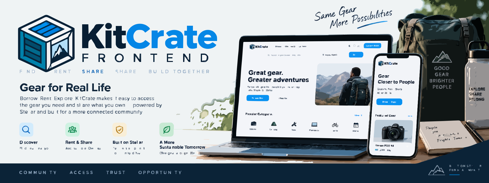
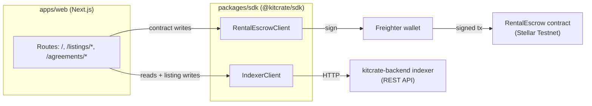

<p align="center">
  
</p>

# KitCrate Frontend

**The marketplace UI and wallet-integration layer for KitCrate's on-chain rental escrow.**

[](https://github.com/KitCrate/kitcrate-frontend/actions/workflows/ci.yml)


KitCrate is a peer-to-peer marketplace for renting physical equipment — tools, cameras, construction gear, event equipment — secured by a non-custodial Soroban escrow rather than a platform holding the money. This repository is the web app renters and owners actually use, plus the typed SDK that connects it to the [kitcrate-backend](https://github.com/KitCrate/kitcrate-backend) contract and indexer.

Currently deployed against **Stellar Testnet** only.

## Project Links

| | |
| --- | --- |
| **Live app** | [kitcrate-frontend-web.vercel.app](https://kitcrate-frontend-web.vercel.app) |
| **Live API (backend)** | [kitcrate-indexer.onrender.com](https://kitcrate-indexer.onrender.com) |
| **Documentation** | [kitcrate.github.io/kitcrate-backend](https://kitcrate.github.io/kitcrate-backend/) |
| **Backend repo** | [github.com/KitCrate/kitcrate-backend](https://github.com/KitCrate/kitcrate-backend) |

## What this app is

An npm workspaces monorepo with two packages: `apps/web`, the Next.js app renters and owners use, and `packages/sdk` (`@kitcrate/sdk`), the typed client that talks to the `RentalEscrow` Soroban contract and the backend indexer API on its behalf. Components never call the chain or the backend directly — they go through the SDK.

## How it works

- **`packages/sdk`** — wallet connection (Freighter), XDR encoding, a typed `RentalEscrowClient` for building and submitting contract calls, and a typed `IndexerClient` for the backend's REST API.
- **`apps/web`** — the Next.js App Router app. Contract writes (create, fund, start, claim, release, cancel, plus the two permissionless liveness-recovery calls) go through the connected wallet via the SDK; reads go through the backend indexer API rather than direct contract calls. Listing writes (create/edit/delete, no on-chain equivalent) go through the same wallet, signing a SEP-53 challenge the indexer verifies before accepting them.

### User journeys

**As an owner**, from the app's current routes:
- List equipment (`/listings/new`) and edit or remove a listing you own (`/listings/[id]/edit`) — both wallet-signed via SEP-53, no on-chain transaction.
- Confirm handover once a renter has funded an agreement (`start_rental`, on `/agreements/[id]`), which moves it to `Active`.
- Receive the escrowed funds once the rental period completes (`release_funds`), or respond to a renter's claim during a dispute (`resolve_dispute` path, handled by the contract's arbiter role — not a wallet action in this UI).

**As a renter**, from the app's current routes:
- Browse listings (`/`) and view a listing's detail and booking panel (`/listings/[id]`).
- Fund an agreement after it's created (`fund_agreement`), and track it under `/agreements`.
- Reclaim the full escrowed amount yourself if the owner never confirms handover (`reclaim_funded_agreement`, after the contract's 7-day timeout), raise a claim during an active rental (`raise_claim`, via the claim form on `/agreements/[id]`), or resolve a stalled dispute after the contract's 14-day timeout (`resolve_expired_dispute`).

Only workflows wired into the current UI are listed above; for the complete contract-level state machine (including agreement cancellation before funding), see the backend's [Protocol Mechanics](https://kitcrate.github.io/kitcrate-backend/protocol-mechanics.html) doc.

## Frontend architecture



`apps/web` never imports a Soroban or database client directly — every chain or backend interaction is mediated by `packages/sdk`.

## Setup

Prerequisites: Node.js >= 20 (see [Known limitations](#known-limitations) for the actual minimum), npm >= 9 (for workspaces), the [Freighter](https://www.freighter.app/) browser extension for anything that signs a transaction.

```sh
npm install                                  # installs every workspace
cp apps/web/.env.example apps/web/.env.local # then fill in the values
npm run dev
```

The app runs at `http://localhost:3001` (pinned off 3000 so it doesn't collide with the kitcrate-backend indexer's default port).

### Environment variables

Real variables from `apps/web/.env.example`: `NEXT_PUBLIC_CONTRACT_ID`, `NEXT_PUBLIC_TOKEN_CONTRACT_ID`, `NEXT_PUBLIC_SOROBAN_RPC_URL`, `NEXT_PUBLIC_NETWORK_PASSPHRASE`, `NEXT_PUBLIC_INDEXER_API_URL`. No variables are required for the production build to succeed — the app degrades gracefully to its unconfigured state (contract writes disabled, listing/agreement reads empty) rather than failing the build.

## Development

```sh
npm run dev            # apps/web, http://localhost:3001
npm run typecheck      # both workspaces
npm run lint           # apps/web
```

## Testing

```sh
npm test --workspace=@kitcrate/sdk
```

`packages/sdk` has real unit test coverage; `apps/web` currently has none beyond typecheck/lint/build (see [Known limitations](#known-limitations)).

**Production build:**

```sh
npm run build
```

## Deployment

The live app deploys to Vercel via GitHub integration (auto-deploy on push to `main`); there's no `vercel.json` in this repo, so build settings live in the Vercel dashboard. CI (typecheck, lint, SDK tests, production build) runs independently of that deploy and does not gate it.

## Known limitations

- **Node version.** Root `package.json` states `"node": ">=20"`, but `@stellar/stellar-sdk@16.2.0` (a direct SDK dependency) requires Node >=22 and warns on install otherwise. `npm install` still succeeds on Node 20, but Node 22+ is the version this repo actually needs.
- **Multisig accounts need enough signature weight.** A Soroban invocation from an account requires total signer weight meeting that account's medium threshold. A single Freighter-connected key on a multisig account can fall short of it, in which case the network rejects an otherwise correctly built and signed transaction with `txBadAuth`. The SDK detects this ahead of signing (`getAccountSignatureRequirement`) and the UI surfaces a clear message instead, on every write flow that builds a transaction from the connected wallet's own address.
- **Vercel hosting.** Unlike the backend's Render free tier, Vercel's free (Hobby) tier doesn't sleep the app between requests, so there's no equivalent cold-start delay to document here.
- **`apps/web` has no automated tests.** SDK logic (`packages/sdk`) has real unit test coverage; the Next.js app itself has none — no component tests, no end-to-end tests. Typecheck, lint, and a full production build all run in CI, which catches a real class of breakage, but not a behavioral regression in a component.
- **The deployed backend contract predates this repo's hardened source.** The live indexer API and Testnet contract this app talks to by default may not yet include the backend's latest liveness-recovery and listing-auth changes — see the backend's [Testnet status](https://github.com/KitCrate/kitcrate-backend#testnet-status) for the current state.

## Contributing

See [CONTRIBUTING.md](./CONTRIBUTING.md): this project isn't currently accepting outside contributions.

## Maintainer

**Hollujay**
- GitHub: [@Hollujay](https://github.com/Hollujay)
- Telegram: [@Hollujay21](https://t.me/Hollujay21)

## License

[MIT](./LICENSE).
